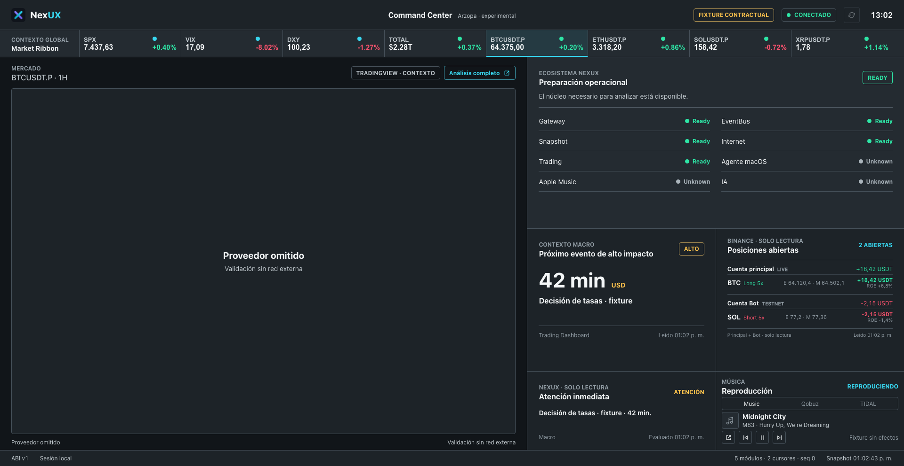
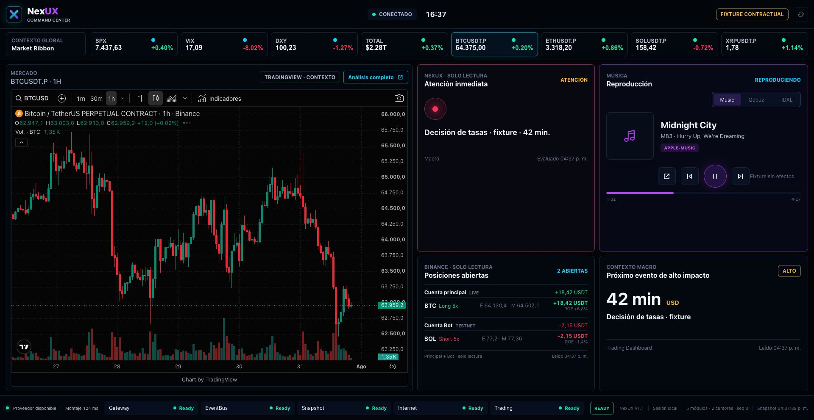
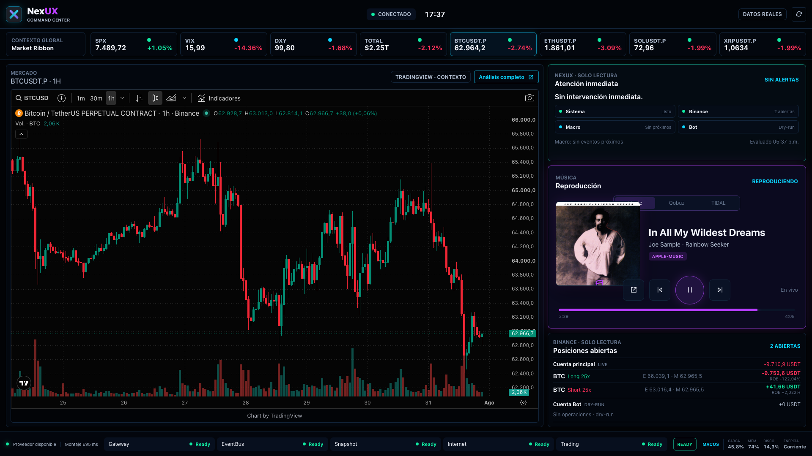

# Design Review: nueva etapa de refinamiento

Fecha: 2026-07-31  
Rama: `codex/command-center-contract-v1`  
Estado: validación técnica local, sin despliegue

## Resumen ejecutivo

El Command Center dejó de organizarse como una página con paneles equivalentes.
Ahora se comporta como una superficie de escritorio: el mercado ocupa el foco,
la atención y la música reciben jerarquía propia, y el estado técnico se reduce a
una franja inferior compacta.

La revisión también concluye que el gráfico propio de NexUX todavía no debe
reemplazar a TradingView. NexUX posee mejores capas de dominio, pero no dispone
aún de un proveedor gráfico único ni de la madurez operativa necesaria para ser
la superficie principal.

## Decisiones tomadas

### Superficie de aplicación

- Se eliminó la cabecera central de aspecto editorial.
- La marca, conexión, hora y origen de datos forman ahora una barra de aplicación.
- Se redujeron márgenes y separaciones exteriores para usar el viewport completo.
- El gráfico quedó enmarcado como herramienta de trabajo, no como sección de una web.
- La composición objetivo ocupa exactamente `1920 x 992`, sin scroll ni overflow.

### Lado derecho

Se retiró el panel permanente `Ecosistema NexUX`. Sus ocho filas consumían espacio
para repetir información estable o inmadura. La salud necesaria permanece visible
en el footer y solo incluye:

- Gateway
- EventBus
- Snapshot
- Internet
- Trading

Agente macOS, Apple Music e IA dejaron de ocupar una fila permanente de salud.
Esto no elimina sus capacidades; elimina ruido del viewport.

La nueva composición responde cuatro preguntas:

1. ¿Hay algo que requiera atención ahora?
2. ¿Qué se está reproduciendo?
3. ¿Qué posiciones están abiertas?
4. ¿Cuál es el próximo evento macro relevante?

### Música

Música pasó de ser una fila compacta a una superficie prioritaria:

- carátula de `112 x 112`;
- canción, artista, álbum y proveedor diferenciados;
- selector explícito para Music, Qobuz y TIDAL;
- controles anterior, play/pausa y siguiente;
- control separado para abrir la aplicación;
- progreso y tiempos de reproducción.

El progreso no modifica `MediaController` ni el Wire ABI. Se publica como metadato
opcional de la superficie:

- Apple Music entrega posición y duración reales mediante AppleScript.
- Qobuz y TIDAL entregan una fracción normalizada solo cuando Accessibility expone
  valor mínimo, máximo y valor actual confiables.
- Si el proveedor no ofrece evidencia suficiente, la UI muestra progreso desconocido.

### Color y profundidad

La paleta dejó de depender de grises casi equivalentes. Se incorporaron superficies
azul-neutras, cian para contexto, verde para estado sano, ámbar para advertencia,
rojo para riesgo y magenta para música. Los bordes luminosos son deliberadamente
sutiles y comunican jerarquía, no decoración.

## Evidencia visual

### Antes

La salud operativa dominaba el lado derecho, Música quedaba comprimida y el footer
solo mostraba metadatos técnicos. La composición era legible, pero se percibía como
un dashboard web.

### Después

Validación automática en `1920 x 992`:

- documento: `1920 x 992`;
- cinco servicios esenciales visibles;
- cero paneles con overflow;
- progreso de fixture: `1:32 / 4:27`, `34,5%`;
- gráfico y contexto permanecen visibles sin scroll.

## NexUX Chart vs TradingView

| Dimensión | Gráfico NexUX | TradingView actual |
|---|---|---|
| Datos futures Binance | Nativo, REST + WebSocket | Disponible en el widget |
| Temporalidades | Configurables | Amplia selección integrada |
| Volumen, RSI y ADX | Implementados en Trading | Indicadores integrados |
| SMC, POI y divergencias | Implementados y propios | No disponibles en widget público |
| Fases, pivotes y precios calculados | Implementados en Acción del precio | Requieren indicadores del usuario |
| Entradas y estados Bot2 | Implementados | No integrados con NexUX |
| Historial incremental | Implementado | Resuelto por proveedor |
| Dibujo manual | No existe como sistema completo | Maduro |
| Persistencia de layout | Fragmentada por módulo | Madura en sesión autenticada |
| Búsqueda y cambio de símbolo | Parcial | Maduro |
| Indicadores privados / Pine / LuxAlgo | No | Sí, en TradingView autenticado |
| Alertas | No unificadas | Maduras |
| Accesibilidad y teclado | Parcial | Más madura |
| Contrato ChartProvider | Todavía no implementado | Spike conforme |
| Mantenimiento | Propio y actualmente duplicado | Externo |

### Ventajas reales del gráfico NexUX

- Puede representar conceptos que TradingView no conoce: POI, estados del bot,
  fases causales, precios calculados y contexto del Diario.
- Usa el mismo precio y venue de las operaciones de NexUX.
- Puede evolucionar sin depender de capacidades comerciales del widget.
- Permite una integración profunda con la atención operacional.

### Carencias antes de promoverlo

- Extraer un núcleo gráfico común. Hoy Trading, Acción del precio y Bot2 mantienen
  implementaciones separadas sobre Lightweight Charts.
- Implementar `NexuxChartProvider` detrás del contrato existente.
- Congelar un modelo común de símbolos, temporalidades, overlays y estado visible.
- Probar montaje, destrucción, reconexión, historial, cambio de TF y degradación.
- Medir memoria, CPU, latencia de primer render y estabilidad durante sesiones largas.
- Incorporar persistencia, accesos de teclado y una política de errores visible.

## Recomendación técnica

Mantener TradingView como proveedor temporal del Command Center.

El siguiente paso correcto es un spike headless de `NexuxChartProvider` que reutilice
el contrato congelado y consolide un núcleo compartido. Su criterio de salida debe
ser comparable al del adaptador TradingView:

1. superar el harness contractual;
2. montar y destruir sin fugas;
3. recuperar WebSocket e historial sin perder contexto visible;
4. mantener precio y velas coherentes con Binance;
5. sostener una sesión prolongada sin degradación;
6. validar perceptualmente en el Arzopa.

Solo después de esa evidencia conviene evaluar el reemplazo. Las capas avanzadas
del gráfico propio justifican la inversión, pero todavía no justifican una promoción.

## Riesgos y límites

- Qobuz y TIDAL dependen de Accessibility y pueden no exponer progreso normalizable
  en todas sus versiones.
- Una carátula ausente sigue mostrando un placeholder; no se inventa contenido.
- La validación visual automatizada no reemplaza la evaluación perceptual de Hugo.
- El footer usa tipografía compacta porque representa estado secundario; debe validarse
  nuevamente a `80-90 cm` en el Arzopa.
- La prueba completa detecta que el dataset del Diario ya no cumple la hipótesis
  histórica de más de 80% de cierres V1 (`38/48`). Es una alerta de research ajena
  al rediseño y no fue silenciada.

## Integridad arquitectónica

- Pruebas Command Center: `267 passed`.
- Suite verificable: `831 passed`, con una prueba de research deseleccionada por
  la alerta V1/V2 descrita arriba.
- Agente macOS Release: build correcto y `48 checks passed`.
- Wire ABI v1: intacto.
- Fingerprint: intacto.
- EventBus: intacto.
- Gateway: intacto.
- Runtime y registro: intactos.
- Factories productivas: 0.
- `main`: sin cambios.
- Railway: sin cambios.
- Producción: sin cambios.

## Siguiente iteración

1. Realizar validación perceptual del rediseño en el Arzopa.
2. Observar progreso real en Apple Music, Qobuz y TIDAL durante una sesión normal.
3. Ajustar únicamente hallazgos perceptuales, sin agregar módulos.
4. Autorizar por separado el spike `NexuxChartProvider` si se decide avanzar.

## Iteración perceptual posterior

La revisión de Hugo confirmó que el gráfico y el Market Ribbon tienen la
jerarquía correcta, pero detectó tres problemas: la barra del navegador impedía
percibir una aplicación, Música seguía siendo secundaria y Macro duplicaba la
pregunta ya resuelta por Atención inmediata.

Se aplicaron estas correcciones sin agregar módulos:

- manifiesto standalone y lanzador macOS con perfil dedicado y modo kiosco para
  abrir Chrome sin pestañas, barra de direcciones ni controles del navegador;
- Música comparte la fila superior con Atención, con carátula de `190 x 190 px`,
  título reforzado, controles mayores y progreso visible;
- Macro deja de ocupar una superficie propia y se integra causalmente en
  Atención inmediata; solo se muestra cuando existe un evento relevante o como
  contexto secundario discreto;
- Posiciones abiertas ocupa todo el ancho inferior y conserva las dos cuentas
  separadas.

La prueba visual a `1280 x 720` confirmó que la carátula conserva `190 x 190 px`
incluso en el breakpoint compacto. La validación definitiva sigue siendo el
Arzopa a `1920 x 992` mediante el lanzador de modo aplicación.

## Shell nativa y cuadrícula macOS

La bandera kiosco de Chrome no resultó estable cuando coexistía con una sesión
normal del navegador. Se reemplazó por una shell nativa macOS basada en
`WKWebView`, con ventana sin bordes sobre el Arzopa y barras de sistema ocultas.
Los enlaces externos, como Análisis completo, continúan abriéndose en el
navegador habitual.

La primera cuadrícula redujo TradingView a una celda superior y agregó debajo una
lectura local de macOS. Esa composición validó la integración técnica, pero la
revisión perceptual posterior mostró que daba demasiado protagonismo a métricas
que cambian lentamente. La lectura local expone solamente carga normalizada,
memoria, disco, energía, versión y uptime. No publica procesos, aplicaciones
abiertas ni información personal.

La validación directa en el Arzopa `1920 x 1080` confirmó:

- ausencia de pestañas, dirección y barra de menú;
- TradingView cargado dentro de la shell nativa;
- macOS `ready` con datos reales y frescos;
- cuatro zonas visuales alineadas;
- Música, Atención y Posiciones sin superposición horizontal.

## Refinamiento de jerarquía premium

La composición posterior reemplaza la igualdad entre paneles por una jerarquía
explícita. No se agregaron módulos ni nuevas funciones:

- TradingView ocupa aproximadamente el `67%` del ancho útil y toda la altura de
  trabajo disponible bajo el Market Ribbon.
- Atención inmediata se convierte en un centro compacto de cuatro fuentes:
  Sistema, Binance, Macro y Bot. La ausencia de alertas ya no produce un panel
  vacío.
- Música usa carátula de `200 x 200 px`, controles principales reforzados, título
  de mayor jerarquía y una barra de progreso más visible.
- Posiciones reduce separaciones internas y conserva la distinción entre cuenta
  principal y Bot sin incorporar métricas nuevas.
- macOS deja de competir como módulo y pasa al footer como resumen secundario de
  carga, memoria, disco y energía.
- El shell queda limitado estrictamente a un viewport, sin scroll ni crecimiento
  vertical inducido por el contenido.

Esta es la composición recomendada para la siguiente validación perceptual en el
Arzopa. Preserva TradingView como proveedor principal y mantiene libre el mismo
espacio físico para un futuro `NexuxChartProvider`.
