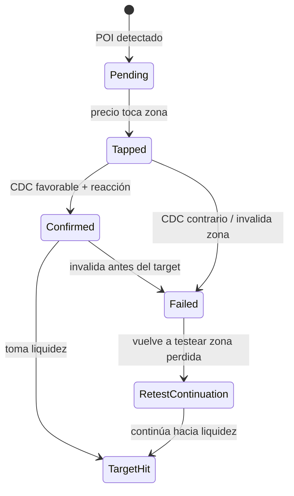

# Playbook operativo BTA observado

Fecha: 2026-07-01.  
Fuente: capturas locales y re-navegación en vivo del TradingView `Bitcoin Traders Academy`, `BTCUSDT.P`, `15m`.

Este documento separa observación directa de inferencia. No pretende copiar el indicador del profe; busca convertir lo visible en reglas auditables para comparar contra Nexux.

## Veredicto

La estrategia visible no es `OB/FVG -> entrada`. Es una lectura por estados:

```text
rango -> premium/discount -> POI -> CDC -> reacción -> liquidez objetivo -> estado de zona
```

La zona aislada no basta. El hallazgo cuantitativo que más conversa con el chart es:

```text
POI + CDC + liquidez
```

Resultado research: `272` trades, `44.9%` WR, `+0.700R`, PF `1.99`.

## Lo observado directamente

### Rango y extremos

Etiquetas/objetos visibles:

- `Máximo`
- `Mínimo`
- `Alto Referencial (Resistencia)`
- `Strong High (Nivel De Resistencia)`
- niveles horizontales rojos/azules

Lectura:

El profe empieza ordenando el mapa. Los extremos no son decoración: definen dónde una zona tiene sentido y dónde se invalida. En Nexux esto requiere un objeto `RangeMap`, no sólo pivotes sueltos.

Regla candidata:

```text
Una zona sólo es operable si está dentro de un RangeMap activo
y su invalidación queda contra un extremo o referencia estructural clara.
```

### Premium / Discount

Etiquetas visibles:

- `Premium POI`
- `Premium POI X Confirmación`
- `Discount POI`
- `Discount POI x confirmación`
- `counter POI`

Lectura:

El texto `x confirmación` es clave. Visualmente separa una zona de interés de una zona que ya tiene reacción/CDC. Nexux debe distinguir:

- `poi_watch`: zona para observar;
- `poi_tapped`: zona tocada;
- `poi_confirmed`: zona con CDC/reacción;
- `poi_failed`: zona perdida;
- `poi_retest_continuation`: zona perdida que pasa a funcionar como continuación.

Regla candidata:

```text
No operar un POI sólo por tocarlo.
Requerir CDC o reacción validada dentro de una ventana de N velas.
```

### CDC

Etiquetas visibles:

- `CDC`
- zonas con `x confirmación`
- checkmarks verdes después de reacción

Lectura:

El CDC parece actuar como frontera de carácter. Si se respeta, valida una reacción; si se pierde, puede convertir el setup en continuación contraria.

Estados mínimos:

```text
pending -> broken -> respected/reclaimed -> invalidated
```

Regla candidata:

```text
CDC confirmado =
  después del toque del POI,
  precio rompe carácter en dirección esperada,
  y no invalida la zona antes de alcanzar reacción mínima.
```

### Liquidez objetivo

Objetos visibles:

- mínimos/máximos naranjas;
- `Strong High`;
- `Alto Referencial`;
- caja naranja de llegada;
- trade box con `Objetivo`, `Stop`, `ratio riesgo/beneficio`;
- niveles horizontales apilados.

Lectura:

La operación visible tiene destino. El setup con trade box confirma que el profe mira objetivo, stop, resultado y ratio, no sólo la entrada.

Regla candidata:

```text
Descartar señal si no existe liquidez objetivo con RR >= 2.
Preferir objetivos en weak high/low, rango opuesto, caja objetivo o referencia fuerte.
```

### Estructura / SwingLeg

Objetos visibles:

- zigzag morado;
- pivotes/círculos celestes;
- flechas de leg;
- líneas rojas de medición;
- diagonal roja/naranja;
- etiquetas tipo `0/1`.

Lectura:

Esta es la capa más importante que falta en Nexux. El profe no mira POI flotando en el vacío: conecta pivotes y legs. La dirección del leg decide si una zona es reversa, continuación o trampa.

Regla candidata:

```text
SwingLeg activo =
  pivot_a + pivot_b + dirección + nivel de invalidación + target probable.

Una zona contra el SwingLeg requiere confirmación más fuerte que una zona a favor.
```

## Cómo leer OB/FVG dentro de este mapa

La evidencia visible no permite decir que el profe opere cualquier OB o FVG. Sí permite inferir:

1. OB/FVG puede originar un POI.
2. El POI debe estar en premium/discount correcto.
3. El POI necesita CDC/reacción para pasar de observación a señal.
4. El target debe existir antes de validar la operación.
5. Si el CDC falla, la zona puede cambiar de rol.

Regla práctica para Nexux:

```text
OB/FVG detectado -> Zone.pending
toque -> Zone.tapped
CDC favorable + liquidez RR>=2 -> Zone.confirmed
CDC contrario -> Zone.failed
retest tras fallo -> Zone.retest_continuation
target tomado -> Zone.target_hit
```

## Cuándo ignorar una zona

Ignorar o bajar prioridad si:

- no hay rango operativo claro;
- el POI está en mitad del rango sin premium/discount útil;
- no hay target de liquidez con RR suficiente;
- el CDC no aparece dentro de la ventana esperada;
- el SwingLeg activo va contra la idea y no hay confirmación fuerte;
- la zona ya falló y se está usando como continuación contraria;
- el setup depende sólo de un FVG/OB mecánico sin reacción visible.

## Casos guía

### Junio 2026: mapa completo

Evidencia:

- `2026-06-17_blue_range_premium_discount.jpg`
- `2026-06-24_discount_poi_confirmacion.jpg`
- `live_2026-07-01_current_jun_range.png`

Lectura:

Rango amplio con premium, discount, counter POI, CDC, `Strong High`, mínimo objetivo y reacción. Es el caso base para diseñar `RangeMap + Zone.state + CharacterLevel`.

### Junio 2026: operación completa

Evidencia:

- `live_pan_test_after_scrollX_negative.png`

Lectura:

Trade box con objetivo, stop, cierre PyG, ratio, CDC, pivotes, checks y estructura diagonal. Es la evidencia más clara de que Nexux necesita `TradePlan` y `ZoneOutcome`.

### Mayo 2026: zona perdida como continuación

Evidencia:

- `2026-05-15_discount_cdc_zones.jpg`
- `2026-05-27_drop_to_orange_target.jpg`

Lectura:

Una zona originalmente discount puede dejar de ser long si el CDC se pierde. Después la lectura pasa a retest/continuación bajista. Este caso evita la simplificación peligrosa de “Discount = long”.

### Diciembre 2025: zigzag/pivotes

Evidencia:

- `live_back_autoscale_2026_to_2025_04.png`
- `live_drag_history_2026_2025_01.png`

Lectura:

Confirma capa de estructura. No basta con clasificar highs/lows; hay que conectar pivotes en legs activas.

## Máquina de estados propuesta



## Implementación Nexux sugerida

Orden:

1. `RangeMap`
   - extremos operativos;
   - EQ;
   - premium/discount;
   - referencias `Strong High`, `Alto Referencial`, weak high/low.
2. `Zone.state`
   - `pending`, `tapped`, `confirmed`, `failed`, `retest_continuation`, `target_hit`.
3. `CharacterLevel`
   - CDC persistente con estado.
4. `TradePlan`
   - entry, stop, target, RR, resultado.
5. `SwingLeg`
   - pivotes conectados, dirección, invalidación, target.

Primera regla para producción research:

```text
setup_candidate =
  POI en premium/discount correcto
  AND liquidez objetivo RR >= 2
  AND CDC confirmado dentro de 16 velas
  AND riesgo <= 1.2%
```

Después agregar:

```text
setup_confirmed =
  setup_candidate
  AND Zone.state == confirmed
  AND SwingLeg no contradice la dirección
```

## Riesgos

- La evidencia 2026 es fuerte; 2025/2024 sigue incompleta.
- Parte de la plantilla puede tener objetos manuales del profe.
- Las capturas antiguas originales tuvieron duplicados; por eso el inventario en vivo separa evidencia útil y descartable.
- El rango manual del profe no siempre coincide con una ventana fija; hay que probar varios modelos de `RangeMap`.

## Gate antes de tocar bot vivo

No llevar esto al bot vivo hasta tener:

- 20+ casos visuales independientes;
- al menos 5 casos 2025 y 5 casos 2024, o evidencia documentada de que el layout no contiene anotaciones útiles allí;
- backtest fuera de muestra para `CDC + liquidez + Zone.state`;
- revisión manual de casos conflictivos como `2026-05-15`.
